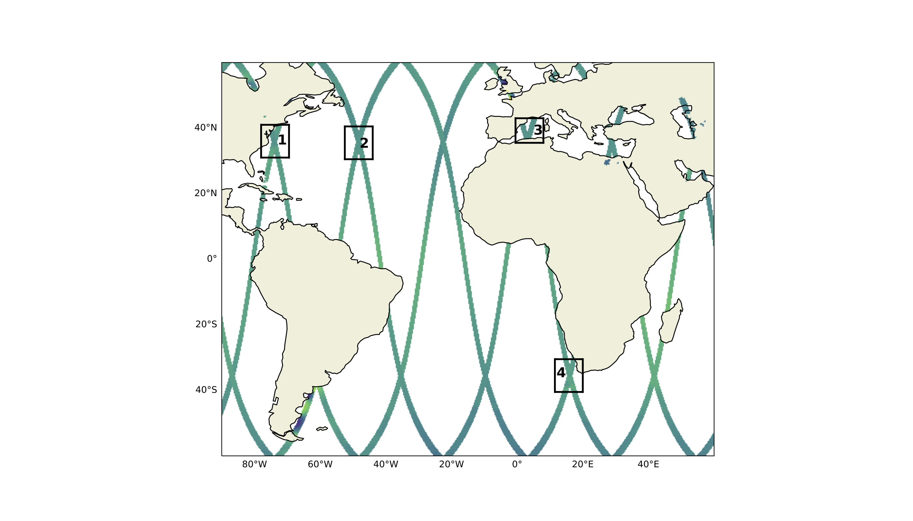

SWOT Adopt-A-Xover ocean model intercomparison study
====================================================

With the upcoming launch of the Surface Water and Ocean Topography (SWOT) satellite in 2021
and advent of submesoscale-permitting basin-scale simulations,
we would like to formulate a baseline
to compare the upcoming observations of submesoscale turbulence.
The models we currently have in mind are summarized in the following table:

================  ===============  =======================  =======  ============
Simulation name   Basin coverage   Resolution               Model    Institution
================  ===============  =======================  =======  ============
eNATL60_          North Atlantic   :math:`1/60`             NEMO     MEOM
MEDWEST60_        Mediterranean    :math:`1/60` (ensemble)  NEMO     MEOM
MEGATL            North Atlantic   :math:`1/60`             CROCO    LOPS
HYCOM50           North Atlantic   :math:`1/50`             HYCOM    COAPS
llc4320_          Global           :math:`1/48`             MITgcm   JPL
lNATL60           Agulhas region   :math:`1/60`             NEMO     GEOMAR
================  ===============  =======================  =======  ============

The initial four regions of study will be in the Gulf Stream (78-69.5W, 30-40N; region 1),
mid-Atlantic (52.5-44W, 30.5-40.5N; region 2), Mediterranean Sea (0.5W-8E, 35.5-43N; region 3)
and the Agulhas Current (11.5-20E, 40.5-30.5S; region 4). 
The regions are shown in the figure below
along with the SWOT fast-sampling-phase trajectories:

    
Pending on the success of these four regions, we will increase the number of regions to 10.
If you would like to contribute with your dataset, please to reach out to us by raising an
`issue on Github <https://github.com/roxyboy/SWOT-AdAC-ocean-model-intercomparison/issues>`_.
In order to allow for efficient cloud storage, we ask you to provide the dataset in 
`zarr <https://zarr.readthedocs.io/en/stable/spec/v2.html>`_ format
and a `yaml file to catalog <https://intake.readthedocs.io/en/latest/catalog.html#yaml-format>`_ 
the data per cross-over region.
We recommend `zarrifying <https://zarr.readthedocs.io/en/stable/tutorial.html#compressors>`_ the dataset with the following command:

.. code-block:: python

   compressor = numcodecs.Blosc(cname='snappy', clevel=6, shuffle=-1)
   
   encoding = {vname:{'compressor': compressor} for vname in ds.variables}
   
   ds.to_zarr(path, mode='w')
   
Please also provide the information regarding the coordinate system and equation of state used for density.

Example notebooks of analyzing sea-surface data are given 
`here <https://github.com/roxyboy/SWOT-AdAC-ocean-model-intercomparison/tree/master/sea_surface_variability>`_.

.. _eNATL60: https://catalog.pangeo.io/browse/master/ocean/MEOM_NEMO/
.. _MEDWEST60: https://presentations.copernicus.org/EGU2020/EGU2020-11127_presentation.pdf
.. _llc4320: https://catalog.pangeo.io/browse/master/ocean/LLC4320/
