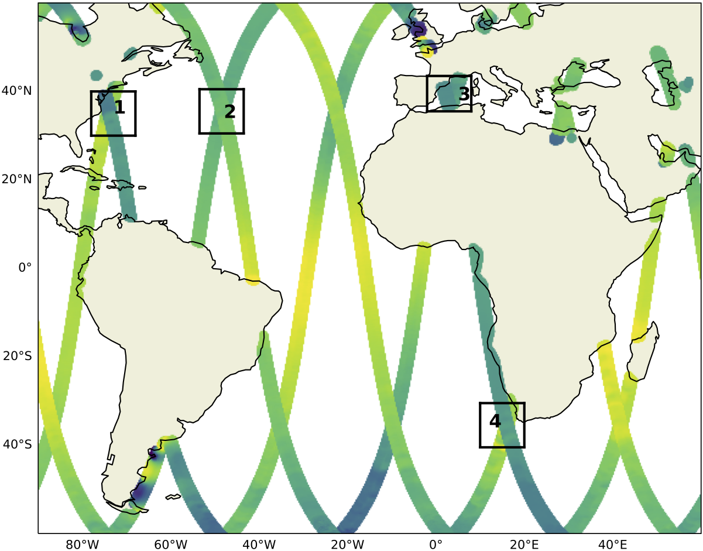

SWOT Adopt-A-Xover ocean model intercomparison study
====================================================

With the upcoming launch of the Surface Water and Ocean Topography (SWOT) satellite in 2022
and advent of submesoscale-permitting basin-scale simulations,
we would like to formulate a baseline
to compare the upcoming observations of submesoscale turbulence.
The models we currently have in mind are summarized in the following table:

================  ===============  =======================  =======  ============
Simulation name   Basin coverage   Resolution               Model    Institution
================  ===============  =======================  =======  ============
eNATL60_          North Atlantic   :math:`1/60`             NEMO     MEOM
MEDWEST60_        Mediterranean    :math:`1/60` (ensemble)  NEMO     MEOM
GIGATL            Atlantic         :math:`1 km`             CROCO    LOPS
HYCOM50           North Atlantic   :math:`1/50`             HYCOM    COAPS
llc4320_          Global           :math:`1/48`             MITgcm   JPL
lNALT60           Agulhas region   :math:`1/60`             NEMO     GEOMAR
FESOM             North Atlantic   :math:`1 km`             FESOM    AWI
SM-telescope_     North Atlantic   :math:`600 m`            ICON-O   MPI-M
================  ===============  =======================  =======  ============

.. _eNATL60: https://vimeo.com/300943265
.. _MEDWEST60: https://presentations.copernicus.org/EGU2020/EGU2020-11127_presentation.pdf
.. _llc4320: https://catalog.pangeo.io/browse/master/ocean/LLC4320/
.. _SM-telescope: https://mpimet.mpg.de/en/communication/multimedia/visualizations/translate-to-englisch-submesoscale-telescope-experiment

The initial four regions of study will be in the Gulf Stream (78W-68W, 30N-40N; region 1),
mid-Atlantic (54W-44W, 30N-40N; region 2), Mediterranean Sea (2W-8E, 35.5N-43.5N; region 3)
and the Agulhas Current (11.5E-20E, 40.5S-30.5S; region 4).
The regions are shown in the figure below
along with the SWOT fast-sampling-phase trajectories:

Pending on the success of these four regions, we will increase the number of regions to 10.
If you would like to contribute with your dataset, please read the `Consortium Agreement <./Consortium-Agreement.rst>`_
and reach out to us by raising an
`issue on Github <https://github.com/roxyboy/SWOT-AdAC-ocean-model-intercomparison/issues>`_.
We are currently in the process of setting up a project-specific cloud storage and Jupyterhub
where collaborators involved would have access to the data and Python-based analytical tools.
In order to allow for efficient cloud storage, we will ask you to provide the regional dataset in
the format detailed in the `Data Request <https://github.com/roxyboy/SWOT-AdAC-ocean-model-intercomparison/blob/master/Data-Request.rst>`_.

Example notebooks of analyzing sea-surface data are given
`here <https://github.com/roxyboy/SWOT-AdAC-ocean-model-intercomparison/tree/master/sea_surface_variability>`_.
